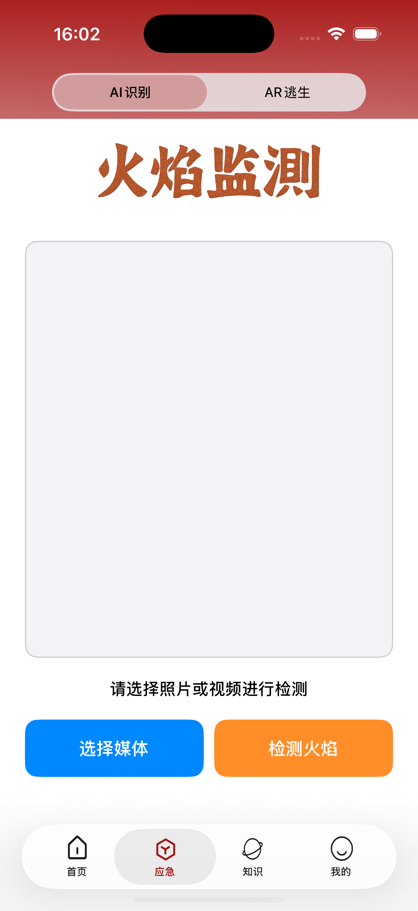
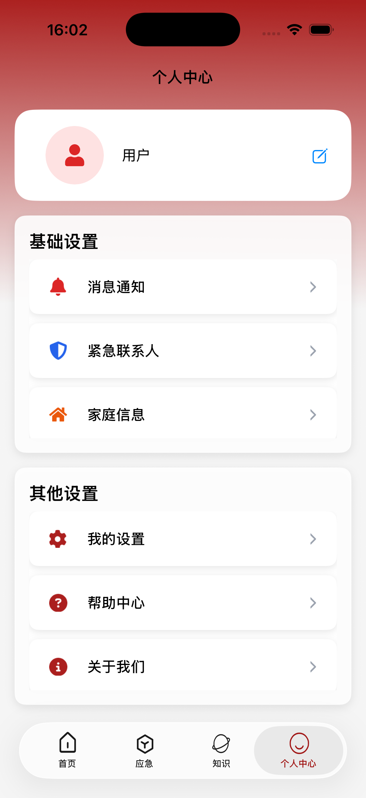

# FlameGuard

> 一款结合yolo大模型火焰识别，以及科普的App

---

## 项目截图

<p align="left">
  
  
  
  
</p>


---

## AR障碍识别模块

### 前端框架

- **UIkit**: 构建现代化UI界面
- **RealityKit**: AR场景渲染和管理
- **ARKit**: 苹果AR核心功能

### 架构模式

- **MVVM模式**: 
  - View: UIkit视图
  - ViewModel: ARDetectionViewModel
  - Model: ARKit数据

### 核心功能模块

#### 1. AR场景管理

```swift
ARViewContainer - AR视图容器
ARWorldTrackingConfiguration - 世界追踪配置
```

#### 2. 障碍物检测系统

- **多传感器融合检测**:
  - 深度数据检测 (LiDAR/TrueDepth)
  - 特征点分析
  - 平面几何识别

- **智能决策**:
  - 置信度计算
  - 稳定性验证
  - 距离阈值管理

#### 3. 用户交互

- 实时状态反馈
- 危险等级提示
- 会话控制（重置、暂停）

### 关键技术特点

1. **实时性**: 1秒间隔的持续环境扫描
2. **准确性**: 多算法交叉验证
3. **稳定性**: 历史数据防抖动
4. **兼容性**: 支持多种AR设备

### 应用场景

- 火灾等紧急情况下的障碍物检测
- 为视觉障碍者提供导航辅助
- 环境安全评估

这是一个基于iOS AR技术的实时障碍物检测系统，主要利用设备传感器数据来识别前方障碍并提供安全提示。


## **AR逃生路径模块**

### 1. 技术栈

- **前端框架**: SwiftUI + RealityKit + ARKit
- **数据持久化**: Codable协议 + UserDefaults
- **运动感知**: CoreMotion框架
- **3D渲染**: RealityKit引擎

### 2. 系统模块

#### 2.1 数据层

```swift
// 核心数据模型
struct SavedMap: Codable        // 保存的地图数据
struct PathPoint: Codable       // 路径点数据
class MapDataManager: ObservableObject  // 数据管理
```

**功能特点**:

- Codable协议实现自动序列化
- UserDefaults本地存储
- 发布者模式实现数据响应式更新

#### 2.2 AR导航引擎

##### 路径记录模块 (PathRecorder)

- **技术基础**: CMMotionManager设备运动追踪
- **核心算法**: 
  - 基于加速度计的位移估算
  - 磁力计方向感知
  - 坐标系转换（设备坐标到世界坐标）
- **数据输出**: 连续的路径点序列

##### 路径导航模块 (PathNavigator)

- **导航逻辑**: 路径点跟随算法
- **进度计算**: 实时距离和进度估算
- **状态管理**: 导航状态机控制

#### 2.3 AR可视化系统

##### 场景管理

```swift
ARViewContainer - AR场景容器
ARNavigationContainer - 导航专用容器
```

##### 3D元素渲染

- **路径可视化**: 球体标记 + 长方体连线
- **方向指示**: 3D箭头模型
- **状态标记**: 颜色编码系统（绿起点/红终点/蓝当前位置）

##### 火焰模拟系统 (FireEntityManager)

- **模型加载**: OBJ格式火焰模型
- **材质系统**: SimpleMaterial + 自定义纹理
- **动画效果**: 定时器驱动的缩放动画
- **平面检测**: 自动水平面识别和放置

### 3. 用户界面架构

#### 3.1 视图层级

```
主视图 (ContentView)
├── 地图列表 (MapCardView)
├── AR录制视图 (ARRecordingView)
├── 地图详情 (MapDetailView)
└── AR导航视图 (ARNavigationView)
```

#### 3.2 特色UI组件

- **指南针视图 (CompassView)**: 实时方向指示
- **2D地图视图 (MapPathView)**: 路径平面展示
- **导航面板**: 进度和距离信息显示
- **录制统计**: 实时数据监控

### 4. 核心算法

#### 4.1 位移估计算法

```swift
// 基于加速度的双重积分位移估算
displacement = acceleration × Δt² × 缩放因子
// 考虑设备方向的坐标旋转
rotatedDisplacement = rotateVector(displacement, heading)
```

#### 4.2 路径平滑处理

- **历史数据缓存**: 防止路径抖动
- **距离阈值**: 最小移动距离过滤
- **方向一致性**: 连续方向验证

#### 4.3 AR空间定位

- **世界对齐**: gravityAndHeading模式
- **平面检测**: 水平和垂直平面识别
- **环境纹理**: 自动环境贴图

### 5. 性能优化

#### 5.1 内存管理

- **适时清理**: AR会话暂停和资源释放
- **实体复用**: 锚点实体管理
- **纹理优化**: 适当的分辨率和材质设置

#### 5.2 电量优化

- **更新频率控制**: 0.1秒间隔的运动更新
- **选择性渲染**: 必要时才显示AR内容
- **后台暂停**: 视图消失时停止AR会话

### 6. 用户体验设计

#### 6.1 交互流程

1. **路径记录**: 实时运动追踪和可视化
2. **地图管理**: 列表展示和详情查看  
3. **AR导航**: 3D路径指引和进度反馈
4. **紧急模拟**: 火焰场景和逃生引导

#### 6.2 视觉反馈

- **多状态指示**: 录制中、导航中、完成状态
- **渐进式引导**: 平面检测→火焰放置→开始导航
- **错误处理**: 网络提示和恢复机制

## 技术亮点

1. **多模态导航**: 2D地图 + 3D AR双重展示
2. **离线优先**: 完全本地化的数据存储和处理
3. **实时响应**: 基于Combine框架的响应式数据流
4. **设备适配**: 支持从iPhone 6s到最新设备的多级功能降级
5. **紧急场景优化**: 简化交互、突出关键信息的UI设计

## 应用场景

- 建筑物逃生路线预记录和演练
- 火灾等紧急情况下的实时导航
- 室内复杂环境的路径指引
- 应急疏散训练和教育工具


